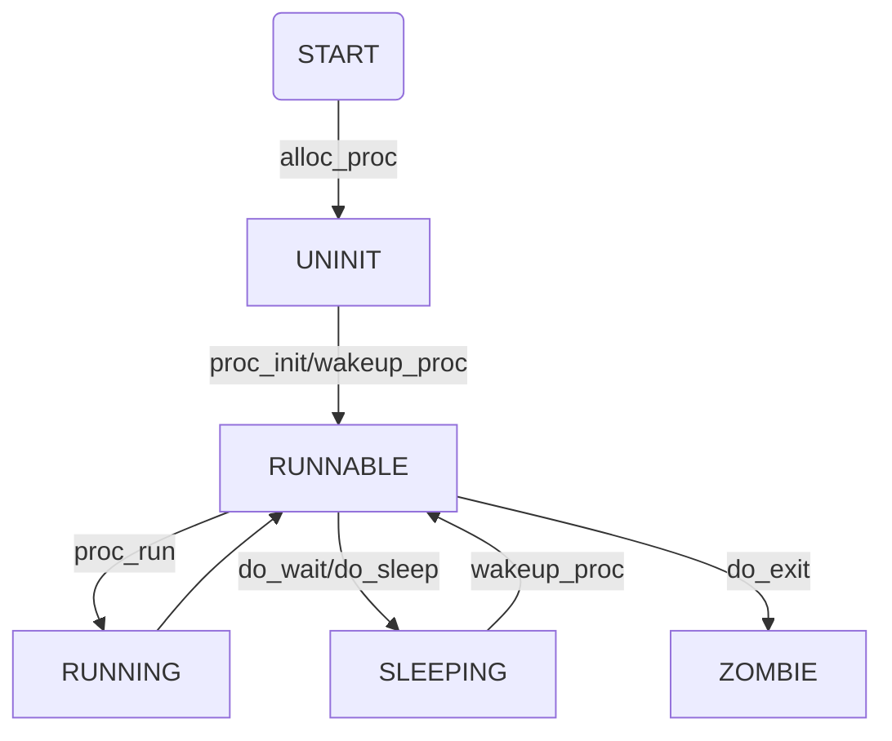

首先要修改一些之前的代码。。。合并的时候一开始还没注意。。
proc中的lab4代码要多初始化一些东西，trap中的lab1代码要调整系统调用中断级别，以及时钟中断时候时间片到了当然要准备切换进程啦

另外一个破坑。。。之前写完代码make grade会有两个命令过不去。。。看一看grade.sh发现。。。要把lab1加的输出tick。。。去掉。。。简直神坑。。

# 练习一

实际上要写的代码极其简短，给trapframe各项赋好给定的值就完了

## 问题一
请在实验报告中描述当创建一个用户态进程并加载了应用程序后，CPU是如何让这个应用程序最终在用户态执行起来的。即这个用户态进程被ucore选择占用CPU执行（RUNNING态）到具体执行应用程序第一条指令的整个经过。

首先是第零个进程创建的第一个内核进程执行init_main函数，进一步调用kernal_thread创建用户进程，而后进入调度schedule->proc_run,分别切换当前进程，而后进行切换上下文的一系列操作，从而开始运行用户进程，而实际开始执行的函数是填入的user_main函数再调用kernal_execve函数通过系统调用SYS_exec，而后的过程如vector128(vectors.S)-->__alltraps(trapentry.S)-->trap(trap.c)-->trap_dispatch(trap.c)---->syscall(syscall.c)-->sys_exec（syscall.c）-->do_execve(proc.c)，做好mm的检查而后进入load_icode函数，这里的资料上写的以及函数注释解释的非常细致，最后将中断帧修改从而在跳回trapentry的iret跳至用户代码

过程中的BSS段之前没有听说过，查了一下含义
>BSS段通常是指用来存放程序中未初始化的或者初始化为0的全局变量和静态变量的一块内存区域。 特点是可读写的，在程序执行之前BSS段会自动清0。

# 练习二

拷贝内存的代码，实际写的部分依旧很少并且注释很详细

调用过程 do_fork->copy_mm->dup_mmap->copy_range

cow看一下如果写的话就不在这里写了

# 练习三

## 从用户态的fork到内核态的do_fork
user/forktest.c的main调用fork来创建新进程，从fork到do_fork的调用过程如下：

fork -> sys_fork(位于user/lib/syscall.c) -> syscall(SYS_fork) -> sys_fork(kern/syscall/syscall.c) -> do_fork

## do_fork的实现
分配一个进程控制块，设置其state为UNINIT

为内核栈分配2页的内存空间，并将其地址记录在进程控制块的kstack字段中

复制父进程的内存空间到新进程

为新进程分配pid

设置新进程的父进程、子进程等关系信息

将新进程添加到进程链表proc_list和哈希表hash_list中

设置新进程的state为RUNNABLE，从而将其唤醒。

## exec的实现
exec的功能是在已经存在的进程的上下文中运行新的可执行文件，替换先前的可执行文件。在ucore中exec对应的函数是do_execve。

do_execve首先检查用户态虚拟内存空间是否合法，如果合法且目前只有当前进程占用，则释放虚拟内存空间，包括取消虚拟内存到物理内存的映射，释放vma，mm及页目录表占用的物理页等。

调用load_icode函数来加载应用程序

重新设置当前进程的名字，然后返回

## wait的实现
wait的功能是等待子进程结束，从而释放子进程占用的资源。在ucore中wait对应的函数是do_wait。

遍历进程链表proc_list，根据输入参数寻找指定pid或任意pid的子进程，如果没找到，直接返回错误信息。

如果找到子进程，而且其状态为ZOMBIE，则释放子进程占用的资源，然后返回。

如果找到子进程，但状态不为ZOMBIE，则将当前进程的state设置为SLEEPING、wait_state设置为WT_CHILD，然后调用schedule函数，从而进入等待状态。等再次被唤醒后，重复寻找状态为ZOMBIE的子进程。

## exit的实现
exit的功能是释放进程占用的资源并结束运行进程。在ucore中exit对应的函数是do_exit。

释放页表项记录的物理内存，以及mm结构、vma结构、页目录表占用的内存。

将自己的state设置为ZOMBIE，然后唤醒父进程，并调用schedule函数，等待父进程回收剩下的资源，最终彻底结束子进程。

## 流程图

# 扩展

首先找到调用copy_range的地方..vmm里的dup_mmap share=1

copy_range里设好share的部分

最后在处理缺页的部分do_pgfault将原来的复制代码改一下放上去就完了