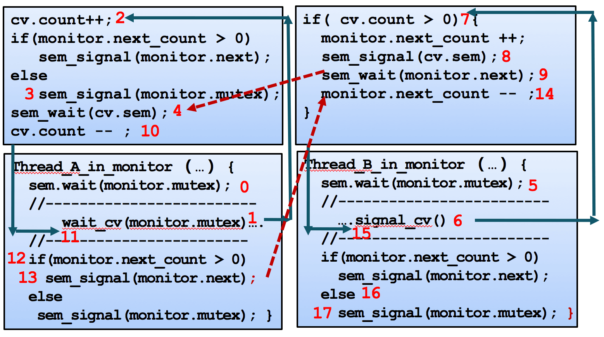

同上 需要修改trap.c 换一个函数

# 练习一

## 问题一
信号量 有 计数值 等待队列

up down操作都要保存eflag寄存器

对于up操作，先看等待队列中还有没有 没有信号量+1走人 有的话唤醒然后删除等待队列里的

对于down操作，信号量大于零的话说明没有别的玩意访问互斥区，减一走人，否则进等待队列调度等到啥时候回来了从等待队列里再删了它

mutex初始化成1 别的分析函数基本就能看出来

## 问题二

实际的底层函数肯定还是这些 但是不能直接用了显然，多做一个系统调用，pcb块里提前放一个信号量指针，系统调用初始化信号量以及down up巴拉巴拉

# 练习二
monitor.c check_sync.c 照着注释写即可 理清关系有点费劲...更费劲的大概是...理清了过一会就又忘了...

顺便发现...实际上好多检测过不去的原因...跑的太慢了...更改测试脚本最大延时的情况下输出是能够正常前进没有死锁的...纯粹是慢...

## 问题一

有个图...然而还是时常混乱...

## 问题二

实际上和上一个练习是一个意思...设置系统调用

## 问题三

需要的是一个能保证互斥的机制，不一定非得是信号量